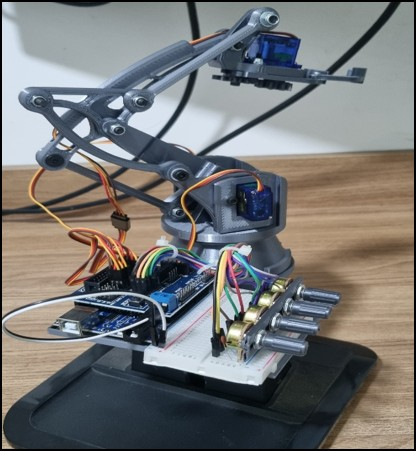
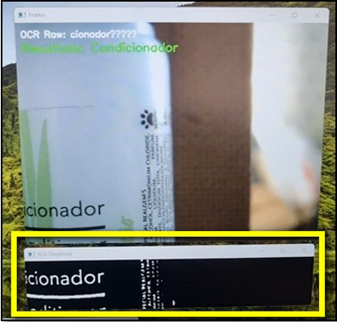
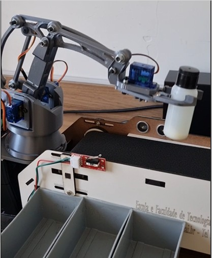
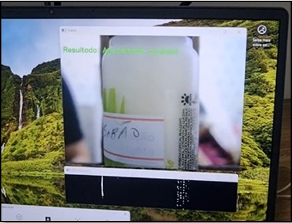
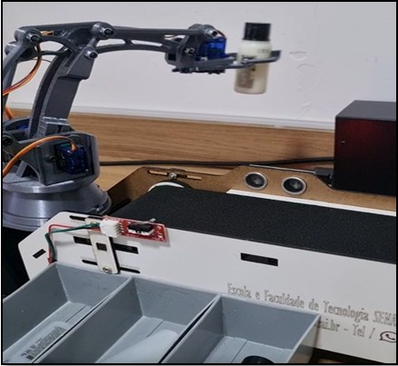

# 📦 Visão Computacional para Identificação de Frascos com OCR

Este repositório apresenta um sistema embarcado desenvolvido para identificar e classificar frascos de shampoo, condicionador e loção hidratante utilizando visão computacional com OCR (Reconhecimento Óptico de Caracteres). O sistema foi implementado com um Raspberry Pi 4, câmera USB, PyTesseract e integração com Arduino para automação física da separação dos frascos.

---

## 🎯 Objetivo

Automatizar a triagem de frascos por leitura de texto nos rótulos, acionando um braço robótico para a separação adequada, utilizando um sistema de visão de baixo custo.

---

## 🧠 Tecnologias Utilizadas

- Python 3
- OpenCV
- PyTesseract
- NumPy
- Arduino Uno
- Câmera Logitech C270
- Sensores ultrassônicos HC-SR04
- Motor DC + Ponte H L298N
- Braço robótico com potenciômetros

---

## 📁 Estrutura do Projeto

```
📁 imagens/
 ├── braço_levandopeça_box4_descarte.jpg
 ├── braçocoletandofrasco.jpg
 ├── braçorobotico.jpg
 ├── frascos.jpg
 ├── reconhecimentopeçadesconhecida.jpg
 ├── reconhecimentofrasco.jpg
 ├── 2025-06-25_112028.jpg
 ├── 2025-06-25_112050.jpg
 └── 2025-06-25_112107.jpg

📁 src/
 ├── Codigo_Integracao_PythonArduino_2sensores_funcionando.ino
 ├── Atualizado_FimdeCurso.ino
 └── arduino_integration_tesseractocr.py

README.md
```

---

## 🖼️ Diagramas do Sistema

### 🛠️ Comando da Esteira


### 🎯 Sistema de Visão Computacional


### 🤖 Controle do Braço Robótico


---

## 📸 Imagens Reais do Projeto


### 🤖 Braço Robótico Montado



### 🧴 Frascos utilizados no experimento


### 📷 OCR Reconhecendo o texto no rótulo



### 🧪 Coleta e separação de frascos

Coletando Frasco Para levar a caixa de destino.




### 🚫 Peça com etiqueta simulando erro (“sabão”)



Levando a peça para a posição de descarte, foi configurado como box4 no código.



---

## 🚀 Como Executar

1. Clone o repositório:
```bash
git clone https://github.com/tomtecsolutions/visao-embarcada.git
cd visao-embarcada
```

2. Instale as dependências:
```bash
pip install opencv-python pytesseract numpy
```

3. Configure o caminho do Tesseract no Windows:
```python
pytesseract.pytesseract.tesseract_cmd = r'C:\Program Files\Tesseract-OCR\tesseract.exe'
```
- **No Raspberry Pi (Linux):**
```python
pytesseract.pytesseract.tesseract_cmd = '/usr/bin/tesseract'
```

4. Execute o script Python:
```bash
python src/arduino_integration_tesseractocr.py
```

5. Carregue os códigos `.ino` nos respectivos Arduinos:
- `Codigo_Integracao_PythonArduino_2sensores_funcionando.ino`: controle da esteira
- `Atualizado_FimdeCurso.ino`: controle do braço robótico

ps: Para o controle do Braço robótico é necessário a instalaçaõ da biblioteca "VarSpeedServo.h"

Para o mapeamento do braço robótico, foi realizado manualmente por meio de potenciometros simples de 10k usando capacitores cerâmios de 100nF entre GND e Sinal para reduzir os ruídos.
Caso queria seguir o exemplo, carregue o código abaixo, abra o monitores serial, e ao ir mexendo os potênciometros vai atualizando as posições no monitor serial, basta ir anotando em um bloco de notas as posições desejadas e depois copiar no código principal do controle automático.

- `Projeto_Pot_Manual_Atualizado_funcionando.ino`: mapeamento manual do braço com potenciometros

---

## 👨‍💻 Autor

**Eng. Wellington de Oliveira Dorta**  


---

## 📄 Licença

Este projeto está licenciado sob os termos da [MIT License](LICENSE).
