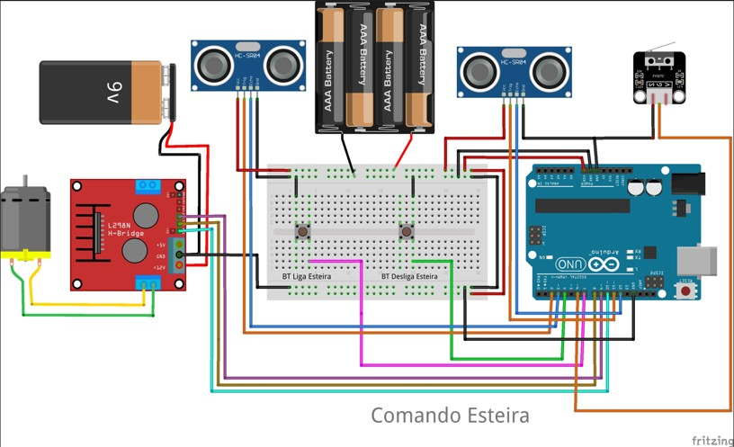
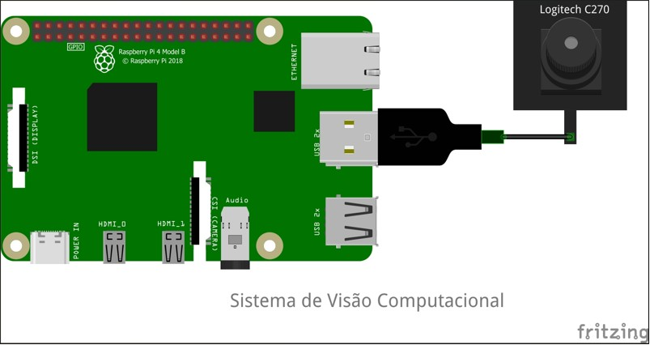
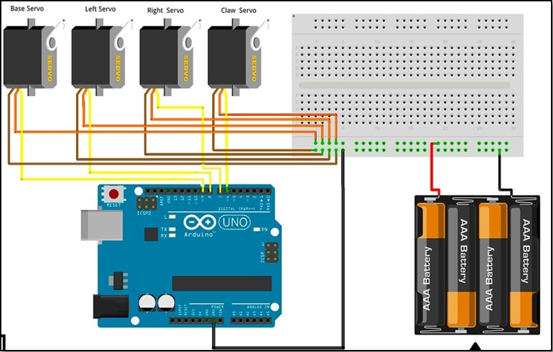

# 👁️ Visão Computacional Aplicada à Classificação e Separação de Peças com Sistemas Embarcados

Este projeto apresenta dois experimentos práticos utilizando visão computacional com sistemas embarcados para automação industrial de baixo custo. O primeiro experimento classifica cápsulas de café com base em imagens treinadas via Teachable Machine. O segundo experimento utiliza OCR com PyTesseract para identificar frascos de shampoo, condicionador e loção hidratante.

## 📌 Objetivo

Desenvolver um sistema de classificação automática de objetos utilizando Raspberry Pi 4, câmera USB, sensores e Arduino Uno, aplicando técnicas de visão computacional acessíveis e eficazes.

---

## 🧠 Tecnologias Utilizadas

- Raspberry Pi 4
- Python 3
- OpenCV
- PyTesseract
- NumPy
- TensorFlow / Keras
- Teachable Machine (Google)
- Arduino Uno + IDE
- Motor DC, ponte H L298N
- Braço robótico com servomotores
- Sensores ultrassônicos HC-SR04

---

## 🖼️ Diagramas do Sistema

### 🔌 Diagrama 1 – Comando da Esteira

Controle da esteira com Arduino, motor DC e sensores.



---

### 🧠 Diagrama 2 – Sistema de Visão Computacional

Conexão entre Raspberry Pi 4 e câmera Logitech C270.



---

### 🤖 Diagrama 3 – Braço Robótico com Servomotores

Controle dos eixos do braço com Arduino Uno.



---

## 🧪 Resultados

- Reconhecimento em tempo real de cápsulas de café com mais de 90% de acurácia.
- Classificação por OCR com palavras-chave, direcionando cada frasco para sua caixa específica.
- Integração eficiente entre visão computacional e dispositivos físicos com comandos via serial.

---

## 🚀 Como Executar

1. Clone o repositório:
```bash
git clone https://github.com/seu-usuario/visao-embarcada.git
cd visao-embarcada
```

2. Instale as dependências:
```bash
pip install opencv-python pytesseract numpy tensorflow
```

3. Execute o script desejado:
```bash
python src/classificacao_capsulas.py
# ou
python src/leitura_ocr_frascos.py
```

---

## 📂 Estrutura do Projeto

```
📁 imagens/
   └── 2025-06-25_112028.jpg
   └── 2025-06-25_112050.jpg
   └── 2025-06-25_112107.jpg
📁 src/
   └── classificacao_capsulas.py
   └── leitura_ocr_frascos.py
README.md
```

---

## 👨‍💻 Autor

**Wellington de Oliveira Dorta**  
TCC — Faculdade SENAI  
Orientador: Michel Chaparro

---

## 📄 Licença

Este projeto está licenciado sob os termos da [MIT License](LICENSE).
