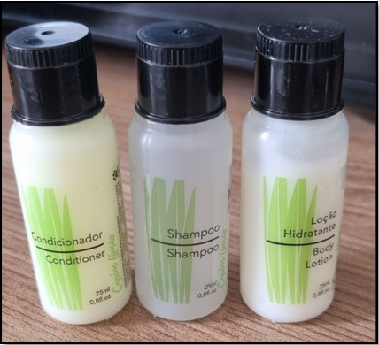

# 📦 Visão Computacional para Identificação de Frascos com OCR

Este repositório apresenta um sistema embarcado desenvolvido para identificar e classificar frascos de shampoo, condicionador e loção hidratante utilizando visão computacional com OCR (Reconhecimento Óptico de Caracteres). O sistema foi implementado com um Raspberry Pi 4, câmera USB, PyTesseract e integração com Arduino para automação física da separação dos frascos.

---

## 🎯 Objetivo

Automatizar a triagem de frascos por leitura de texto nos rótulos, acionando um braço robótico para a separação adequada, utilizando um sistema de visão de baixo custo.

---

## 🧠 Tecnologias Utilizadas

- Python 3
- OpenCV
- PyTesseract
- NumPy
- Arduino Uno
- Câmera Logitech C270
- Sensores ultrassônicos HC-SR04
- Motor DC + Ponte H L298N
- Braço robótico com potenciômetros

---

## 📁 Estrutura do Projeto

```
📁 imagens/
 ├── braço_levandopeça_box4_descarte.jpg
 ├── braçocoletandofrasco.jpg
 ├── braçorobotico.jpg
 ├── frascos.jpg
 ├── reconhecimentopeçadesconhecida.jpg
 └── reconhecimentofrasco.jpg

📁 src/
 ├── Codigo_Integracao_PythonArduino_2sensores_funcionando.ino
 ├── Atualizado_FimdeCurso.ino
 └── arduino_integration_tesseractocr.py

README.md
```

---

## 🖼️ Diagramas e Imagens do Projeto

### 🛠️ Braço Robótico Coletando Frascos


### 📦 Braço Robótico Real com Potenciômetros


### 🔍 Sistema OCR reconhecendo texto "Condicionador"


### 🚫 Simulação de peça desconhecida com texto "sabão"


### ♻️ Separação automática para descarte


### 🧴 Produtos utilizados no experimento



---

## 🚀 Como Executar

1. Clone o repositório:
```bash
git clone https://github.com/seu-usuario/visao-ocr-frascos.git
cd visao-ocr-frascos
```

2. Instale as dependências:
```bash
pip install opencv-python pytesseract numpy
```

3. Configure o caminho do Tesseract no Windows:
```python
pytesseract.pytesseract.tesseract_cmd = r'C:\Program Files\Tesseract-OCR\tesseract.exe'
```

4. Execute o script Python:
```bash
python src/arduino_integration_tesseractocr.py
```

5. Carregue os códigos `.ino` nos respectivos Arduinos:
- `Codigo_Integracao_PythonArduino_2sensores_funcionando.ino`: controle da esteira
- `Atualizado_FimdeCurso.ino`: controle do braço robótico

---

## 👨‍💻 Autor

**Eng. Wellington de Oliveira Dorta**  

---

## 📄 Licença

Este projeto está licenciado sob os termos da [MIT License](LICENSE).
